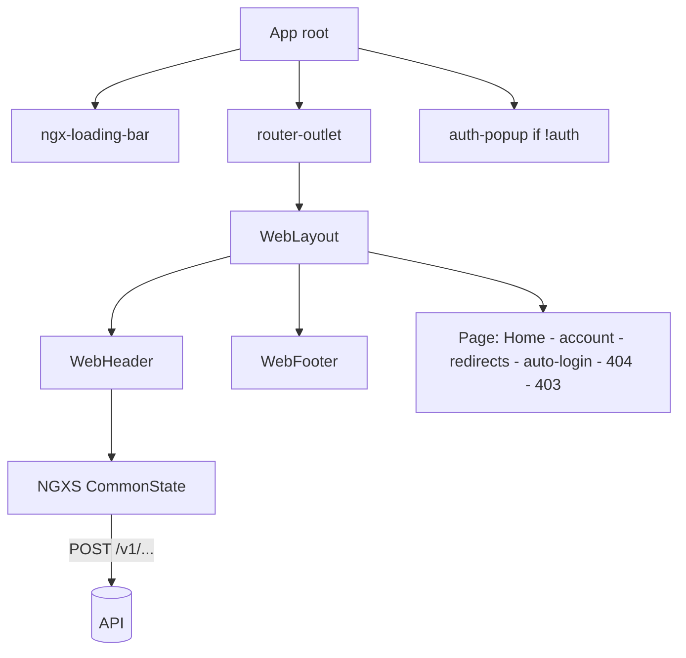
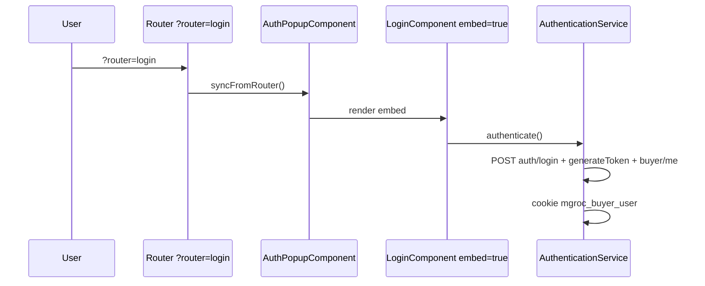
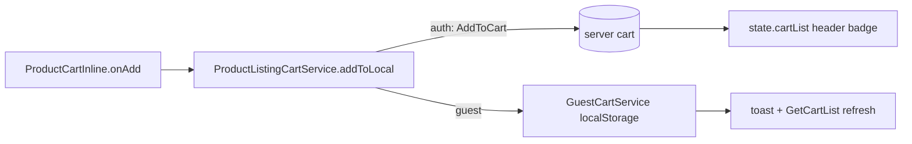

# Angular (mgroc) → React (Vite SPA) Migration Plan — Structure Only

> **Locked constraints for this plan:** No functionality change. No API integration change
> (same endpoints, same envelope, same cookies/keys). No UI change (same Tailwind +
> SCSS + BEM + texts). Transform **structure only**. Update `.env` **only if needed**.
> Decision: **Vite + React SPA only** (no SSR in v1, no dual build).

## 0. Workspace reconciliation (verified 2026-09-22, implemented 2026-09-23)

- This workspace (`frontendai`) is already a **Vite + React 19 + TS 5.9 SPA**.
- Implemented structure (moves + alias rewrites + compat shims, zero logic change):

```
src/
  app/
    core/http/{http,env,case,util,enums,index}.ts
    core/auth/{auth,index}.ts
    core/guards/index.ts          # placeholder (Phase 4)
    core/interceptors/index.ts    # placeholder (Phase 4)
    core/i18n/index.ts            # placeholder (namespaces core/auth/ecommerce)
    core/layouts/{Navbar,Sidebar,index}.tsx
    core/services/{ai,analytics,...,taigaBoard,acceptedPlan,...,index}.ts
    pages/common/{7 views + index}.tsx
    pages/csr-pages/{19 views + 3 project-* + index}.tsx
    pages/ssr-pages/index.ts      # empty by design (unknown UI)
    shared/components/{Collapsible,ThemedLoader,index}.tsx
    shared/models/index.ts        # moved from src/types
    shared/utilities/{use-mobile,index}.ts
    shared/{directives,pipes,validators}/index.ts  # placeholders
    store/index.ts                # placeholder (Phase 4+)
  environments/{base,development,staging,uat,production,index}.ts
  components/*.tsx                # back-compat shims -> new paths
  lib/{api/index + per-file shims}  types/index  hooks/use-mobile  # shims
```

- Aliases: `@/*` kept; added `@app/@core/@pages/@store/@env/@shared` in
  `tsconfig.json` + `vite.config.ts`.
- Validation 2026-09-23: `tsc` has **zero TS2307/TS2882** (module) errors;
  remaining 13 errors are pre-existing logic typos (`setSprints`, `hasPrData`,
  `hasDelaySignal`, `effectiveDelayRisk`, `hasPrediction`, `confidenceValue`,
  `Loader2`) untouched per constraint. `npm run build` succeeds (2352 modules,
  dist/ emitted).
- Env: `.env` / `.env.example` unchanged — `VITE_API_BASE_URL=http://localhost:3000/v1`
  verified; no per-mode `.env.*` files created (not needed; `src/environments/`
  reads the single key per MODE).

Env parity (verified, no change needed):

| File | `VITE_API_BASE_URL` | Verdict |
|---|---|---|
| `.env` | `http://localhost:3000/v1` | OK — ends with `/v1`, matches `src/lib/api/env.ts` fallback |
| `.env.example` | `http://localhost:3000/v1` | OK — single required var |
| `src/lib/api/env.ts` | `getEnv('API_BASE_URL','http://localhost:3000/v1')` accepts `VITE_`/`NEXT_PUBLIC_` | OK |

Legacy keys present in `.env` (`VITE_FF_*`, `APP_URL`, `AI_SYNC_COOLDOWN_*`) are
**unread by code** (see §7). Do NOT delete in this step — flagged for cleanup in Phase 2 only.

---
## 1. Architecture Summary (from mgroc Angular source — documented, not invented)

Project: **mgroc** — grocery buyer web app, Angular 20.3, standalone components, strict TS.

| Concern | What the Angular code actually does |
|---|---|
| Builds | Dual-build: SSR (`main-ssr.ts`/`server.ts`, Express, base `/`) + CSR (`main-csr.ts`, base `/customer/`) + dev (`main.ts`). Coordinated by `CrossBuildLinkService` + `BUILD_TYPE` token (`ssr\|csr\|dev`) and `environment.useRouterLinkForAll`. Build-id sync clears stale SW/caches (`core/startup/service-worker-update.ts`, inline script in `index.html`). |
| Routing | `routes/app.routes.ts` exports `ssrRoutes` / `csrRoutes`; dev merges them. `app.routes.server.ts`: `''`, `listings/**`, `listing`, `details/**`, `cart`, `not-found`, `forbidden` = `RenderMode.Server`. Routes: `/` (Home, WebLayout), `/account` (authGuard), `/redirects`, `/auto-login`, `/not-found`, `/forbidden`. Legacy full-page auth routes commented out — auth is global modal via `?router=login\|forgot\|otp\|reset\|registration\|create&enc=…`. |
| Guards | `authGuard` (unauth → SSR `/` + `?router=login`), `adminGuard` (inverse), `otpGuard` (AES-decrypt `enc`), `canDeactivateGuard`. SSR always returns false (CSR-only). |
| HTTP | `HttpService` wraps `HttpClient`; all POST, prefixed with `environment.host` (`…/v1`). 46 endpoints. Envelope: `{ response: { data, status: { msg } } }`. |
| Interceptors (order) | 1) error: 300s timeout; 401 → refresh-queue (`auth/regenerateToken`, single-flight via `CommonService.isRefreshingToken` + `tokenSubject`); 403 → `/forbidden`; 404 → `/not-found`; 401 on refresh → sign-out. 2) auth header (Bearer + loading-bar). 3) `lang_type` (body/query/FormData). 4) success: optional AES-CBC `enc_data` encrypt/decrypt (`environment.encryption.encryptedRequest=false` today). |
| State (NGXS) | 3 slices: `BuyerState` (buyerDetails, UpdateProfile, Clear), `CommonState` (countries, brands, categories, header menu, banner, ChangePassword), `ProductState` (listings, cart, wishlist, addresses, orders, disputes, best-deals…). ~40 actions: API → patchState → toast → catchError toast + rethrow. |
| Auth | `auth/login` → `auth/generateToken` → dispatch BuyerDetails (`buyer/me`) → cookie `mgroc_buyer_user` (+ in-memory backup in `CommonService`) + remember-me AES cookie + `lang_type` preserved on cleanup. Guest cart `localStorage mgroc_buyer_guest_cart_v1` merges on login (`ProductListingCartService.mergeGuestCart`, wishlist-conflict dialog). Cross-domain handoff `/redirects?enc=…` → `auth/switch`. |
| i18n | `@ngx-translate`, `public/i18n/{core,auth,ecommerce}/{en,pt}.json`, default `pt` (`lang_type` cookie 1=en,2=pt), resolver `translateI18nResolver(feature)`, `TranslationLoaderService` + SSR TransferState, `TranslateI18nTitleStrategy`. |
| Forms | Reactive forms everywhere; validators: `passwordPattern`, `passwordsMustMatch`, `PhoneNotAllZeros`, `NoFirstSpace`, `dateRangeValidator`, `fileErrorValidators`, `countComma`; directives (`noEmoji`, `noSpace`, `digitOnly`, `lettersOnly`…); `submitted/hasFormControlError/isDisabled` pattern per form. |
| Styling | Tailwind 3 (lime `#b0f441`, teal `#21776a`, dark `#1b1f3b`, orange `#ff6f29`, red `#ef133d`; Urbanist; `html{font-size:62.5%}` + `0.534vw`; screens 480/768/976/1440) + SCSS partials (`_mixins.scss`, `_variables.scss`: `font-size()`, `rounded()`, `truncate()`, `custom-scrollbar`) + grid (`_utilities.scss`: `.page-container`, `.row`, `.col-1…12`, 576–1800px) + per-component BEM SCSS + global `styles.scss` (Tailwind base + normalize + toastr + poppins). SVG sprite `/scss/icons.svg` via `<use>`. |
| Shared | `auth-popup` (modal + panel state machine), `cross-build-link`, `breadcrumbs`, `global-search` (800ms debounce), `language-dropdown` (MatSelect), `confirmation-dialog` (MatDialog), `product-cart-inline`, `add-edit-profile`, `change-password`, `customer-root-redirect`; layouts `web-layout/header/footer`, `auth-layout`; 23 directives, 7 pipes, 8 validators, 8 ambient `.d.ts` models. |
| Other services | `EncryptionService` (crypto-js AES), `CryptoService` (WebCrypto AES-CBC), `GuestCartService`, `ProductListingCartService`, `SeoService` (title/meta/canonical/robots/OG), `BeamsService` (push), `AiChatService` (WS), `LocationService` (geo + Nominatim). |
| Tooling | ESLint 9 + angular-eslint, Prettier, Husky + lint-staged, Karma/Jasmine (only `paginator.directive.spec.ts`), aliases `@app/@core/@pages/@store/@env/@shared`. |
## 2. Component & Data Flow (Mermaid — structure view, no behavior change)







## 3. React Architecture — Vite SPA only (structure transform, zero UI/API change)

| Decision | Choice | Structural consequence (behavior unchanged) |
|---|---|---|
| Rendering | Vite + React 18/19 + TS SPA (no SSR v1) | Collapse dual-build to one app/origin. CrossBuildLinkService, BUILD_TYPE, /customer base become legacy to plain router nav. Keep URL contracts: ?router=login-forgot-otp-reset-registration-create, enc, /redirects?enc=. |
| SEO v1 | Client-side only | SeoService to useSeo() hook fed by route loaders. Server meta/OG for listings/details flagged as future phase. |
| Server state | TanStack Query | useQuery = Get actions; useMutation = Add/Delete/Save with same toasts. Same keys (cartList). |
| Client/session | Zustand (buyer, common, product-ui) | Only non-server NGXS: buyerDetails, guest-cart lines, pending sets, auth-popup panel. |
| Forms | react-hook-form + ported validators | Identical error keys so i18n keys match. |
| i18n | i18next (core/auth/ecommerce) | Reuse public/i18n JSON unchanged; lang_type 1=en/2=pt, default+fallback pt, body class english/portuguese. |
| UI primitives | Radix Dialog/Select/Combobox | Replaces MatDialog x1, MatSelect x1, MatAutocomplete x2, MatPaginator x1. SCSS kept. |
| Toasts | toast lib top-right 3000ms no-anim dedupe | 1:1 with provideToastr config. |
| Styling | Tailwind 3 copied verbatim + SCSS | Vite sass includePaths public/scss + partials + custom-styles; BEM untouched. Global: normalize, poppins, _utilities grid, icons.svg. |
| Crypto | keep crypto-js AES + WebCrypto port | Same keys/IVs; enc_data toggle preserved (false today). |
| Testing | Vitest + RTL + MSW | First: refresh queue, validators, guest-cart merge. |
| Tooling/env | ESLint 9 + Prettier + Husky + .env per mode | Map environment files to .env.development/.staging/.uat/.production. Only var read today: VITE_API_BASE_URL (must end /v1). |

### Target folder structure (mirrors Angular src/app; moves + re-exports only)

```
src/
  app/
    core/{http,auth,guards,interceptors,i18n,layouts,services}
    pages/{common,ssr-pages,csr-pages}
    shared/{components,directives,pipes,validators,models,utilities}
    store/
  environments/
  styles/
```

Aliases (extend tsconfig + vite.config; keep @/*):

```
@/* -> ./src/* (keep)
@app/* -> ./src/app/* | @core/* -> ./src/app/core/*
@pages/* -> ./src/app/pages/* | @store/* -> ./src/app/store/*
@env/* -> ./src/environments/* | @shared/* -> ./src/app/shared/*
```

```mermaid
## 4. Angular to React mapping (real examples, structure only)

| Angular | React | Notes (no behavior change) |
|---|---|---|
| LoginComponent Input embed=false | <Login embed /> | prop, same default |
| Output embedForgotPassword | onForgotPassword?: () => void | callback rename only |
| authGuard | <ProtectedRoute> | unauth to /?router=login preserved |
| httpErrorInterceptorFn | errorMiddleware | keep order: error-refresh, auth header+bar, lang_type, crypto |
| translateI18nResolver(ecommerce) | i18nLoader([ecommerce]) | same namespace preload |
| Action(AddToCart) | useAddToCart() mutation | same endpoint + toast |
| <cross-build-link> | <AppLink> | plain router link in SPA v1 |
| HttpService POST + response envelope | httpClient.post + unwrapEnvelope() | same unwrap, same 46 endpoints |
| BuyerState/CommonState/ProductState | Zustand slices + TanStack Query | same keys/selectors |
| auth-popup panel machine | AuthModal + useAuthPanel() | same ?router= sync |

## 5. Migration phases (structure-only)

| # | Phase | Angular sources to React targets | Acceptance |
|---|---|---|---|
| 1 | Analysis (this doc) | whole src/app | doc reviewed, decisions signed |
| 2 | React project setup | angular.json, tailwind.config.js, environments, index.html sync to vite config, src/environments, tokens | build parity, env modes, lint/husky parity; .env unchanged except documented adds |
| 3 | Layout and shared shell | app.*, layouts, web-header/footer, styles.scss, _utilities.scss | visual diff ~0 on / |
| 4 | Auth and API integration | HttpService, 4 interceptors, AuthenticationService, guards, auth-popup + 6 auth forms, EncryptionService | login/refresh/OTP/register/guest-merge e2e pass, same cookies |
| 5 | Reusable components | 10 shared components, 23 directives, 7 pipes, 8 validators | parity checklist each |
| 6 | Feature-by-feature | NGXS to stores/queries; pages (home, my-account, redirects, auto-login, 404/403; unknown listing/cart/order flagged) | endpoint + UI parity per feature |
| 7 | Testing and validation | specs, i18n en/pt, SEO, a11y | coverage gates, Lighthouse >= baseline |
| 8 | Performance and quality | budgets (4/8 MB), splitting, SW/build-id sync | prod budgets met |

## 6. Risks (structure-only lens)

1. Dual SSR/CSR + cross-domain handoff (/redirects, auth/switch, /customer) — preserve URL/cookie contracts.
2. Silent interceptor behavior (refresh queue, EMPTY on 403/404) — easy to break silently.
3. Guest-cart merge + wishlist-conflict dialog — move verbatim first.
4. i18n SSR TransferState + pt default + body class — flicker risk if SSR returns later.
5. Styling drift (Tailwind/SCSS/BEM + 0.534vw rem) — copy config, never modernize.
6. Unknown pages (listings/details/cart/order-list/address) — data exists, UI absent; do not invent.
7. AES keys in environment.ts are client-bundled — flag, do not silently change.

## 7. Env update — only if needed (verified: no change needed today)

- src/lib/api/env.ts reads only API_BASE_URL (VITE_ or NEXT_PUBLIC_), default http://localhost:3000/v1.
- Repo-wide search confirms nothing reads VITE_FF_*, APP_URL, GEMINI_API_KEY.
- Rule: keep .env / .env.example as-is unless backend host changes; then update single value (must end /v1).
- Multi-mode later: .env.development/.staging/.uat/.production each with only VITE_API_BASE_URL. Never commit secrets.

## 8. Recommended first task (structure-only vertical slice)

Scaffold React app in-repo without touching Angular files: copy tailwind.config.js, SCSS partials, index.html sync scripts, environments; implement httpClient + 4 middleware in order + AuthenticationService + ProtectedRoute + one MSW login smoke test. Default location react-app/ (reversible; avoids colliding with Angular src/).

sequenceDiagram
  participant H as httpErrorInterceptor
  participant C as CommonService queue
  H->>H: 401?
  H->>C: queue or auth/regenerateToken
  C->>C: update cookie + tokenSubject
  C->>H: replay with new Bearer
  H->>H: refresh 401 = signOutAndRedirectHome
```


### Missing information (documented, not invented)

- No React code in mgroc repo (verified: no `.tsx/.jsx`); no `docs/` folder there — doc created fresh here.
- `app.routes.server.ts` lists `listings/**`, `listing`, `details/**`, `cart`, `my-account → /order-list & /address` — no page components exist in that repo. Store/i18n for them exist. Flagged as unknown-UI; data/store layer migrates, UI marked TBD.
- `home.component` renders hardcoded mocks though `GetBestDealsProduct/GetBanner/GetPopularThisWeek` exist; `web-header` uses static "John Doe" — real wiring absent.
- `auth.style.component.scss` + `auth-popup.component.scss` fully commented out — verify design source.
- `AclService` commented out, `viewPermissionResolverFn` unwired — permissions dormant.
- `ai-chat.service.ts`, `beams.service.ts`, `explore-subcategory-layout.service.ts` have no visible UI consumers.

